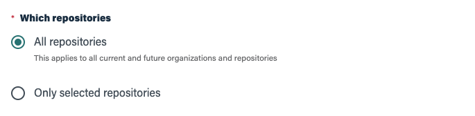

As mentioned in the Skill summary, `lein-m2-deploy` doesn't require a lot of
configuration. Most of the deployment configuration comes from the project.clj
files discovered in your repositories.

## Before you get started

Connect and configure:

1.  [**GitHub**][github] _(required)_

[github]: https://go.atomist.com/catalog/integration/github "GitHub Integration"

## How to configure

1.  **Configure the Maven repository that you'll deploy to**

    Share a deploy repository across your Leiningen projects. This will
    over-ride any `"releases"` deploy-repositories added to your project.clj.

    

2.  **Optionally add some repos that will be used to resolve dependences.**

    These will be added to the ones already in your project.clj files. This is a
    great way to manage the credentials for shared repositories.

3.  **Select files to use for excluding Leiningen projects**

    This skill will only try to deploy libraries in projects where we detect a
    Leiningen Clojure project. However, this can be used to detect Leiningen
    projects that do not support library deployments.

    

4.  **Select a subset of your Repos that support deployment**

    You should only need this during testing. Select "All repositories" once you
    are ready to roll out this policy.

    
